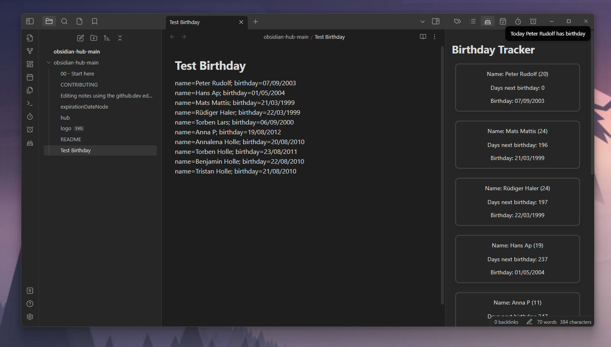
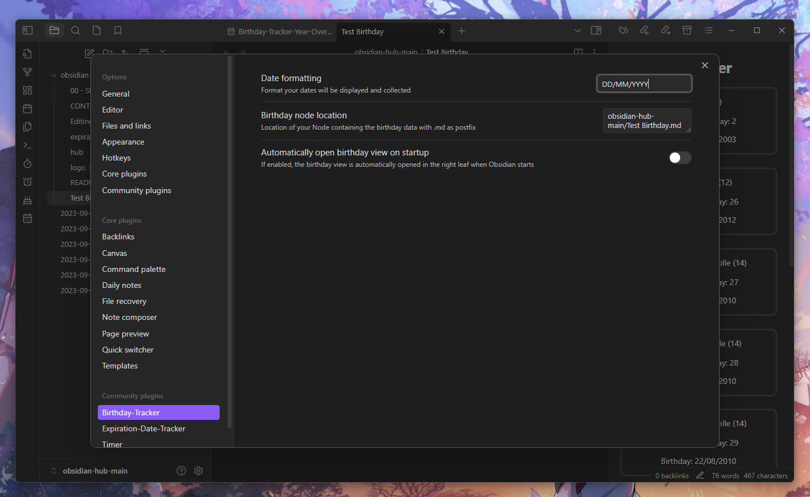

# Obsidian-Birthday-Tracker-Plugin

[](https://github.com/Raboro/Obsidian-Birthday-Tracker-Plugin/releases/latest) [](https://github.com/Raboro/Obsidian-Birthday-Tracker-Plugin/releases/latest)
[](https://github.com/Raboro/Obsidian-Birthday-Tracker-Plugin/actions/workflows/linter.yml)
[](https://github.com/Raboro/Obsidian-Birthday-Tracker-Plugin/actions/workflows/release.yml)

This plugin allows you to keep track of all birthdays of your family and friends.



## Using
You need a file containing all the birthday data.
To find this file you need to add the location in the settings. After that you can add your persons with:
``name=<name of the person>; birthday=<date of their birth>`` \
For example: ``name=Peter Rudolf; birthday=17/08/2033``.
You need the add all those persons line after line:
```
name=Peter Rudolf; birthday=17/08/2033
name=Hans Ap; birthday=01/05/2004
name=Mats Mattis; birthday=21/03/1999
```

After that you can click on the ribbon icon or use the command to trigger the plugin. \
You will receive a notice for all persons who have birthday today and get in a separate view an overview over all persons sorted by their next birthday.

### Year View
You can also use the **Year View** to get an overview over all birthdays. You can also click on the names to get more infomation of this person.


## Settings
You can set a date formatting. The default is: ``DD/MM/YYYY``. This is needed to collect your dates and display them. Also you can set the location of the file containing the birthday data. This must include `.md` as postfix. The default value is: `birthdayNode.md`


